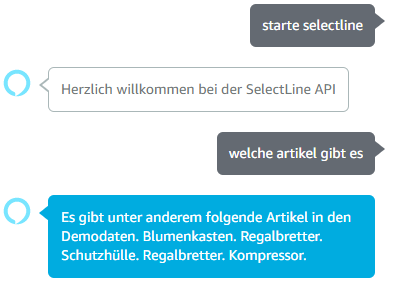

# Alexa Demo für die SelectLine API
# 
Wir veröffentlichen hier den Code für die SelectLine Skill für Alexa. Die Skill lässt Alexa einfache Fragen nach Preisen und Lagerbestand aus einer SelectLine Warenwirtschaft beantworten. Dazu wird über die SelectLine API auf eine Demo-Installation zugegriffen.

## Beispielanfragen

Man startet die Skill mittels:
- *"Alexa starte SelectLine"*

Anschließend kann man Fragen wie diese stellen:
- *"Welche Artikel gibt es"*
- *"Was kostet ein Blumenkasten"*
- *"Was kosten zehn Sessel"*
- *"Wie viele Rasenmäher sind auf Lager"*

Außerdem gibt die Skill Auskunft über Selectline, z.B. via
- *"Sag mit was Interessantes über SelectLine"*
- *"Hast du einen Tipp für mich"*

## Technische Grundlagen des Projektes
Das Projekt beinhaltet zum einen den C#-Code für die AWS-Lambda-Funktion hinter der SelectLine Skill. Außerdem ist das Interaktionsmodell mit hinterlegt (`interactionModel.json`).

Die Lambda-Funktion basiert auf dem Beispiel-Projekt von Amazon/AWS für eine Lambda-Funktion für Alexa. Eine genaue Anleitung, wie man eine solche Funktion baut und deployed, findet sich hier:
https://github.com/aws/aws-lambda-dotnet/

Das Beispielprojekt wurde erweitert und angepasst. Sämtliche Anfragen werden an die öffentlichen Demo der SelectLine API gesendet:
http://demo.slmobile.de/demoApi/

Eine umfassende Hilfe zur SelectLine API gibt es hier:
https://demo.slmobile.de/demoapi/help

In dieser Demo sind Demodaten hinterlegt. Man kann diese Daten auch über die Demo Installation von SelectLine Mobile anschauen:
https://demo.slmobile.de/demo/

